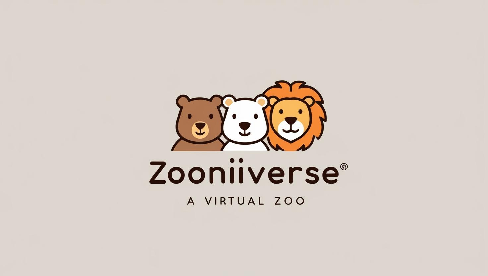

# 🦁 Zooniverse - Zoo Management System

A comprehensive Laravel-based Zoo Management System for creating and managing enclosures and animals.



## ✨ Features

- 🏠 **Enclosure Management**: Create, edit, and delete animal enclosures
- 🐯 **Animal Management**: Add animals to enclosures with proper validation
- 👥 **User Management**: Admin and caretaker roles with different permissions
- 🗄️ **Animal Archiving**: Soft delete functionality for animals
- 📋 **Task Management**: Feeding time tracking for caretakers
- 🔍 **Smart Validation**: Prevents incompatible animals in the same enclosure
- 🌓 **Dark Mode**: Toggle between light and dark themes

## 🛠️ Tech Stack

- **Backend**: Laravel 12.x, PHP 8.2+
- **Frontend**: Bootstrap 5 (CDN), Custom CSS/JS
- **Database**: SQLite
- **Authentication**: Laravel Breeze

## 🚀 Quick Start

### Prerequisites

- PHP 8.2 or higher
- Composer

### Installation

1. Clone the repository:

   ```bash
   git clone <repository-url>
   cd Zoo
   ```

2. Run the initialization script:

   ```bash
   .\init.bat
   ```

   This script will:

   - Install Composer dependencies
   - Create and configure the .env file
   - Generate the application key
   - Create the SQLite database
   - Run migrations and seed the database
   - Create the storage symlink
   - Start the development server

3. Access the application:
   ```
   http://localhost:8000
   ```

## 👤 Default Users

- **Admin User**:

  - Email: admin@admin.com
  - Password: admin

- **Regular User**:
  - Email: user@user.com
  - Password: user

## 🏛️ Database Structure

### Models

- **User**: Zoo administrators and caretakers
- **Enclosure**: Animal habitats with limits and feeding times
- **Animal**: Different species with predator/herbivore classification

### Relationships

- Users can be assigned to multiple enclosures (Many-to-Many)
- Enclosures can contain multiple animals (One-to-Many)
- Enclosures track compatible animal types (predator or herbivore)

## 🧑‍💻 About

This project was created as an assignment for the Server-side Programming course at ELTE University.

## Author

- **Name**: Raczkó Dávid
- **Email**: [raczkodavid@gmail.com](mailto:raczko.david@gmail.com)
